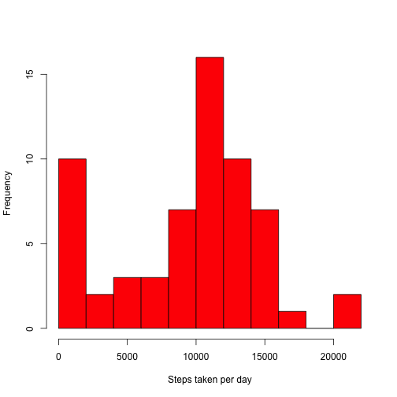
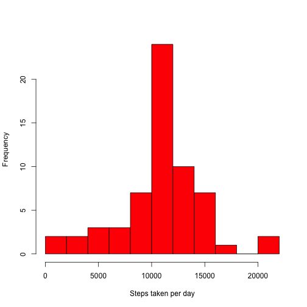
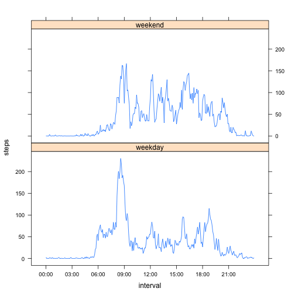

# Reproducible Research: Peer Assessment 1

## Loading and preprocessing the data

The data is stored in a zip file called `activity.zip`, which contains a comma-separated-format file called `activity.csv`. We will unzip and read that file.

The second column contains dates, so we make sure to import accordingly.


```r
opts_chunk$set(echo=TRUE)
unzip("activity.zip")
activity <- read.csv("activity.csv", colClasses = c("numeric", "Date", "numeric"))
library(lattice)
```

## What is mean total number of steps taken per day?

The following histogram shows the total number of steps taken per day, over all days. There are a number of days with no recorded values, resulting in a total-step count of 0.


```r
stepsByDay <- with(activity, tapply(steps, date, sum, na.rm=TRUE))
hist(stepsByDay, breaks=10, col="red", main="", xlab = "Steps taken per day")
```

 

Mean:

```r
mean(stepsByDay, na.rm=TRUE)
```

```
## [1] 9354
```
Median:

```r
median(stepsByDay, na.rm=TRUE)
```

```
## [1] 10395
```

## What is the average daily activity pattern?

We first average the number of steps over each time interval. We also convert those time intervals into actual date/time values.


```r
stepsByInterval <- with(activity, tapply(steps, interval, mean, na.rm=TRUE))
timeIntervals <- as.numeric(names(stepsByInterval))
timeIntervals <- strptime(paste(timeIntervals %/% 100, timeIntervals %% 100, sep=":"), format ="%H:%M")
plot(timeIntervals, stepsByInterval, type="l", xlab="Time of day", ylab = "Average number of steps")
```

 

The time interval with the maximum number of steps is at 8:35AM, with an average of around 206 steps on average.

```r
maxi <- which.max(stepsByInterval)
timeIntervals[maxi]
```

```
## [1] "2014-06-13 08:35:00 EDT"
```

```r
stepsByInterval[maxi]
```

```
##   835 
## 206.2
```

## Imputing missing values

There are 2304 rows with missing values:

```r
sapply(activity, function(x){sum(is.na(x))})
```

```
##    steps     date interval 
##     2304        0        0
```

To fill those values in, we compute, for each interval, the mean number of steps for that time interval across all days:

```r
lookup <- lapply(stepsByInterval, function(x) { x } )
predictedVals <- do.call("c", lookup[as.character(activity$interval)])
```

Then we use these values to fill in any missing values:

```r
activity2 <- activity
activity2$steps <- ifelse(is.na(activity2$steps), predictedVals, activity$steps)
```

Here is the new histogram for steps taken by day:

```r
stepsByDay2 <- with(activity2, tapply(steps, date, sum, na.rm=TRUE))
hist(stepsByDay2, breaks=10, col="red", main="", xlab = "Steps taken per day")
```

 

And the new mean and median:

Mean:

```r
mean(stepsByDay2, na.rm=TRUE)
```

```
## [1] 10766
```
Median:

```r
median(stepsByDay2, na.rm=TRUE)
```

```
## [1] 10766
```

Both values are higher than their predecessors, the mean especially so, as we no longer have a large group of 0 values.

## Are there differences in activity patterns between weekdays and weekends?

We add a new variable to the dataset, representing whether the day was a weekday or a weekend.


```r
activity2$weekday <- factor(ifelse(weekdays(activity2$date) %in% c("Sunday", "Saturday"), "weekend", "weekday"))
```

We then create a new data frame with the aggregated values, averaging over all weekdays and over all weekends for each interval, and draw the corresponding graph.


```r
weekdaySteps <- with(subset(activity2, weekday == "weekday"), tapply(steps, interval, mean))
weekendSteps <- with(subset(activity2, weekday == "weekend"), tapply(steps, interval, mean))
activity3 <- data.frame(steps = c(weekdaySteps, weekendSteps), interval = c(timeIntervals, timeIntervals), weekday = rep(c("weekday", "weekend"), each = length(timeIntervals)))
timePoints <- pretty(timeIntervals, 8)
timeLabels <- format(timePoints, "%H:%M")
xyplot(steps~interval|weekday, data=activity3, scales=list(x=list(at = timePoints, labels=timeLabels)), layout = c(1,2), type="l")
```

 

We can clearly see that there is intense walking activity in the morning on weekdays, while on the weekends it is more spread out over the day.
